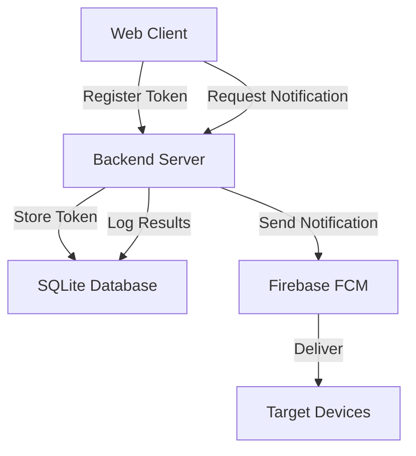

# Push Notification System MVP

A complete **Minimum Viable Product (MVP)** for a push notification system built with Firebase Cloud Messaging (FCM), Node.js backend, and a web client interface.

## 🏗️ Architecture Overview



| Component | Technology | Purpose |
|-----------|------------|---------|
| **Client App** | HTML5 + JavaScript + Service Worker | Device registration and notification display |
| **Backend Server** | Node.js + Express | API server and FCM integration |
| **Database** | SQLite | Store device tokens and notification history |
| **Push Service** | Firebase Cloud Messaging (FCM) | Deliver notifications to devices |

## ✨ Features Implemented

### Core MVP Features
- ✅ Device token registration and management
- ✅ Send notifications to individual devices or all devices
- ✅ Web push notifications with Service Worker
- ✅ Notification history and logging
- ✅ Real-time statistics dashboard
- ✅ Error handling and validation
- ✅ CORS support for cross-origin requests

### Web Client Features
- ✅ Modern, responsive UI
- ✅ Permission request handling
- ✅ Device registration with FCM
- ✅ Send notifications form
- ✅ Test notification functionality
- ✅ Live activity logs
- ✅ Statistics display
- ✅ Progressive Web App (PWA) support

### Backend API Features
- ✅ RESTful API design
- ✅ Input validation with Joi
- ✅ Rate limiting
- ✅ Security headers with Helmet
- ✅ Comprehensive error handling
- ✅ Database migrations
- ✅ Health check endpoint

## 🚀 Quick Start

### Prerequisites
- Node.js (v14+)
- Firebase project with Cloud Messaging enabled
- Modern web browser (Chrome, Firefox, Edge, Safari 16.4+)

### 1. Setup
```bash
# Clone or download the project
cd /Users/shantanuswami/Downloads/open

# Run setup script
./scripts/setup.sh
```

### 2. Configure Firebase
1. Create a Firebase project at [console.firebase.google.com](https://console.firebase.google.com)
2. Enable Cloud Messaging
3. Get your Firebase config and service account key
4. Update `backend/.env` with your Firebase credentials
5. Update `client/public/config.js` with your web app config

### 3. Start Development Servers
```bash
./scripts/start-dev.sh
```

### 4. Test the System
1. Open `http://localhost:8080`
2. Click "Request Notification Permission"
3. Click "Register Device"
4. Send a test notification

## 📁 Project Structure

```
push-notification-mvp/
├── backend/                     # Node.js backend server
│   ├── src/
│   │   ├── models/             # Database models
│   │   │   ├── database.js     # Database initialization
│   │   │   ├── Device.js       # Device token management
│   │   │   └── Notification.js # Notification management
│   │   ├── services/           # Business logic
│   │   │   └── firebaseService.js # FCM integration
│   │   └── routes/             # API routes
│   │       ├── devices.js      # Device endpoints
│   │       └── notifications.js # Notification endpoints
│   ├── .env.example           # Environment template
│   ├── package.json
│   └── server.js              # Main server file
├── client/                     # Web client
│   ├── public/
│   │   ├── index.html         # Main interface
│   │   ├── app.js             # Application logic
│   │   ├── config.js          # Firebase configuration
│   │   ├── sw.js              # Service Worker
│   │   └── manifest.json      # PWA manifest
│   └── package.json
├── scripts/                    # Development scripts
│   ├── setup.sh               # Project setup
│   ├── start-dev.sh           # Start development servers
│   └── test-notification.sh   # API testing
├── SETUP.md                   # Detailed setup guide
└── README.md                  # This file
```

## 🔌 API Endpoints

### Device Management
```http
POST   /api/devices/register           # Register device token
GET    /api/devices/tokens             # Get all active tokens
GET    /api/devices/user/:userId/tokens # Get user's tokens
DELETE /api/devices/token/:token       # Deactivate token
GET    /api/devices/stats              # Device statistics
```

### Notifications
```http
POST   /api/notifications/send                    # Send notification
POST   /api/notifications/send-to-user/:userId    # Send to specific user
GET    /api/notifications/history                 # Notification history
GET    /api/notifications/:id                     # Get specific notification
GET    /api/notifications/stats                   # Notification statistics
```

### System
```http
GET    /health                         # Health check
```

## 🧪 Testing

### Manual Testing
1. Use the web interface at `http://localhost:8080`
2. Test different notification scenarios
3. Verify notifications appear correctly

### API Testing
```bash
# Send test notification via curl
./scripts/test-notification.sh

# Or manually:
curl -X POST http://localhost:3000/api/notifications/send \
  -H "Content-Type: application/json" \
  -d '{
    "title": "Test",
    "body": "Test message",
    "targetTokens": "all"
  }'
```

## 🔒 Security Features

- Input validation with Joi
- Rate limiting (100 requests/15 minutes)
- CORS configuration
- Security headers with Helmet
- Environment variable protection

## 🔮 Future Enhancements

### Phase 2 Features
- [ ] User authentication and management
- [ ] Notification scheduling
- [ ] Rich media notifications (images, buttons)
- [ ] Notification templates
- [ ] A/B testing framework

### Phase 3 Features
- [ ] Mobile app support (React Native/Flutter)
- [ ] Advanced segmentation
- [ ] Analytics dashboard
- [ ] Webhook support
- [ ] Multi-language support

## 📞 Troubleshooting

**🔴 "Permission denied" error**
```
Solution: Ensure notification permissions are granted in browser settings
```

**🔴 "Firebase not initialized" error**
```
Solution: Check Firebase configuration in config.js and sw.js
```

**🔴 "Token registration failed" error**
```
Solution: Verify backend is running and CORS is configured correctly
```

---

**Built with ❤️ for learning and rapid prototyping**
